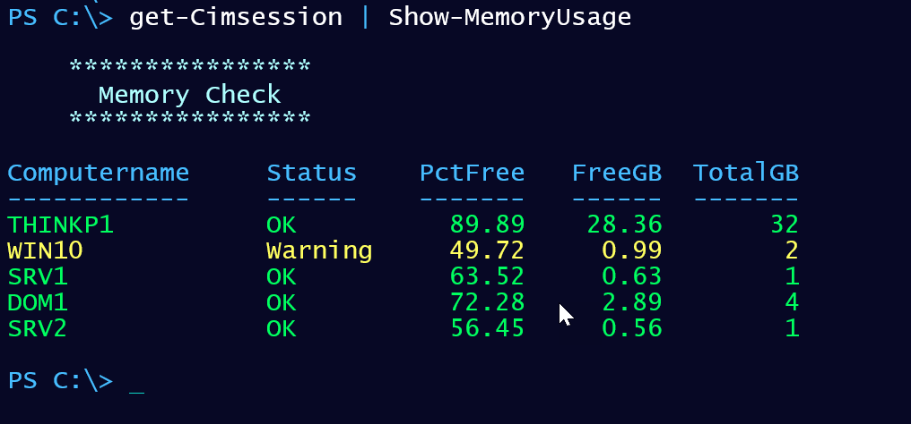

# MemoryTools

[](https://www.powershellgallery.com/packages/MemoryTools/) [](https://www.powershellgallery.com/packages/MemoryTools/)

This module contains a set of PowerShell functions for reporting on computer memory utilization and configuration. The commands use `Get-CimInstance` so remote computers must be running PowerShell 3.0 or later. The project was first described on my [blog](http://bit.ly/1Tooj3Q).

Install the latest version of this module from the PowerShell Gallery.

```powershell
Install-Module MemoryTools [-scope currentuser]
```

## [Get-MemoryUsage](docs/Get-MemoryUsage.md)

This command will write a custom memory utilization object to the pipeline that indicates the current memory state.

```powershell
PS C:\> Get-MemoryUsage

Computername Status PctFree FreeGB TotalGB
------------ ------ ------- ------ -------
PROSPERO     OK        73.5  46.83      64
```

## [Show-MemoryUsage](docs/Show-MemoryUsage.md)

This command will also get the same information as Get-MemoryUsage but will display it with colorized output.



## [Test-MemoryUsage](docs/Test-MemoryUsage.md)

This command can be used to test if memory utilization meets some criteria. There are several parameter sets for different tests. All of them can be used with -Quiet to return a simple Boolean value.

### Percent Free

The default behavior is to see is there is at least 50% free memory, but you can specify a different value.

```powershell
PS C:\> Test-MemoryUsage

Computername PctFree Test
------------ ------- ----
PROSPERO       73.23 True

```

### FreeGB

Test if there is at least X amount of free memory available.

```powershell
PS C:\> Test-MemoryUsage -freegb 8

Computername FreeGB Test
------------ ------ ----
PROSPERO      46.66 True

```

### TotalGB

Test if the computer has at least X amount of total memory.

```powershell
PS C:\> Test-MemoryUsage -TotalGB 16

Computername TotalGB Test
------------ ------- ----
PROSPERO          64 True

```

## UsedGB

Test if the computer is using X amount of memory or greater.

```powershell
PS C:\> Test-MemoryUsage -UsedGB 4

Computername UsedGB Test
------------ ------ ----
PROSPERO      17.37 True

```

## [Get-MemoryPerformance](docs/Get-MemoryPerformance.md)

This command will query memory performance counters.

```powershell
PS C:\> Get-MemoryPerformance

AvailableBytes                       : 36180754432
AvailableKBytes                      : 35332768
AvailableMBytes                      : 34504
CacheBytes                           : 436342784
CacheBytesPeak                       : 588001280
CacheFaultsPersec                    : 0
CommitLimit                          : 78617718784
CommittedBytes                       : 40527859712
DemandZeroFaultsPersec               : 251
FreeAndZeroPageListBytes             : 20220755968
FreeSystemPageTableEntries           : 12448913
LongTermAverageStandbyCacheLifetimes : 14400
ModifiedPageListBytes                : 1235890176
PageFaultsPersec                     : 232
PageReadsPersec                      : 0
PagesInputPersec                     : 0
PagesOutputPersec                    : 0
PagesPersec                          : 0
PageWritesPersec                     : 0
PercentCommittedBytesInUse           : 51
PoolNonpagedAllocs                   : 0
PoolNonpagedBytes                    : 1043083264
PoolPagedAllocs                      : 0
PoolPagedBytes                       : 858091520
PoolPagedResidentBytes               : 802910208
StandbyCacheCoreBytes                : 128360448
StandbyCacheNormalPriorityBytes      : 6915219456
StandbyCacheReserveBytes             : 8916418560
SystemCacheResidentBytes             : 436342784
SystemCodeResidentBytes              : 8192
SystemCodeTotalBytes                 : 8192
SystemDriverResidentBytes            : 15392768
SystemDriverTotalBytes               : 40984576
TransitionFaultsPersec               : 11
TransitionPagesRePurposedPersec      : 0
WriteCopiesPersec                    : 0
DateTime                             : 11/11/2020 5:56:08 PM
ComputerName                         : PROSPERO
```

Or you might use it like this:

```powershell
PS C:\> Get-CimSession | Get-MemoryPerformance | Select-Object Computername,CommittedBytes,AvailableMBytes,CacheBytes

ComputerName CommittedBytes AvailableMBytes CacheBytes
------------ -------------- --------------- ----------
thinkp1          4630245376           29007  139804672
win10            1045913600             989   69541888
srv1              598110208             592   22425600
dom1             1357385728            2913   52137984
srv2              586850304             534   28585984
```

## [Get-PhysicalMemory](docs/Get-PhysicalMemory.md)

This command will query the Win32_PhysicalMemory class to get hardware details.

```powershell
PS C:\> Get-PhysicalMemory -Computername thinkp1

   Computername: THINKP1

Manufacturer CapacityGB Form   ClockSpeed Voltage Location
------------ ---------- ----   ---------- ------- --------
Samsung      16         SODIMM 2667       1200    ChannelA-DIMM0
Micron       16         SODIMM 2667       1200    ChannelB-DIMM0
```

## [Get-TopProcessMemory](docs/Get-TopProcessMemory.md)

This command will use `Get-CimInstance` to retrieve the top processes by *Workingset*. It will retrieve the top 5 by default. The output will include a percentage of total in-use memory the process is using as well as the process owner.

```powershell
PS C:\> Get-TopProcessMemory

Computername : PROSPERO
ProcessID    : 20612
Name         : firefox.exe
WS(MB)       : 1548.55859375
PctUsed      : 8.83
CreationDate : 10/26/2020 1:59:02 PM
RunTime      : 03:23:47.8689917
Commandline  : "C:\Program Files\Mozilla Firefox\firefox.exe" -contentproc
               --channel="19336.20.1545159411\236482607" -childID 3
               -isForBrowser -prefsHandle 5180 -prefMapHandle 5160 -prefsLen
               7680 -prefMapSize 245875 -parentBuildID 20201014125134 -appdir
               "C:\Program Files\Mozilla Firefox\browser" - 19336
               "\\.\pipe\gecko-crash-server-pipe.19336" 5176 tab
Owner        : NT AUTHORITY\NETWORK SERVICE

Computername : PROSPERO
ProcessID    : 5204
Name         : sqlservr.exe
WS(MB)       : 738.671875
PctUsed      : 4.21
CreationDate : 10/26/2020 1:56:58 PM
RunTime      : 03:25:52.2052364
Commandline  : "C:\Program Files\Microsoft SQL
               Server\MSSQL15.SQLEXPRESS\MSSQL\Binn\sqlservr.exe" -sSQLEXPRESS
Owner        : NT AUTHORITY\NETWORK SERVICE

Computername : PROSPERO
ProcessID    : 19336
Name         : firefox.exe
WS(MB)       : 507.62890625
PctUsed      : 2.89
CreationDate : 10/26/2020 1:59:00 PM
RunTime      : 03:23:49.7282834
Commandline  : "C:\Program Files\Mozilla Firefox\firefox.exe"
Owner        : NT AUTHORITY\NETWORK SERVICE

Computername : PROSPERO
ProcessID    : 5412
Name         : Snagit32.exe
WS(MB)       : 444.515625
PctUsed      : 2.53
CreationDate : 10/26/2020 1:57:47 PM
RunTime      : 03:25:02.8728620
Commandline  : "C:\Program Files\TechSmith\Snagit 2020\Snagit32.exe" /i
Owner        : NT AUTHORITY\NETWORK SERVICE

Computername : PROSPERO
ProcessID    : 12556
Name         : thunderbird.exe
WS(MB)       : 436.14453125
PctUsed      : 2.49
CreationDate : 10/26/2020 4:02:00 PM
RunTime      : 01:20:50.0968368
Commandline  : "C:\Program Files\Mozilla Thunderbird\thunderbird.exe"
Owner        : NT AUTHORITY\NETWORK SERVICE
```

Last updated _2020-11-11 23:00:59Z_
